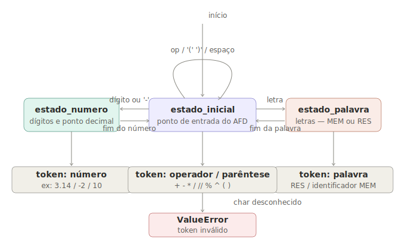

# Analisador Léxico e Gerador de Assembly ARMv7

**Instituição:** Pontifícia Universidade Católica do Paraná  
**Disciplina:** Contrução de Interpretadores  
**Professor:** Frank Coelho de Alcantara  

**Grupo:**
- Eduardo Augusto Camacho d'Oliveira Pavin — [EduardoPavin](https://github.com/EduardoPavin)

---

## Descrição

O programa lê um arquivo de texto contendo expressões aritméticas em notação polonesa reversa (RPN), realiza a análise léxica usando um Autômato Finito Determinístico (AFD) e gera código Assembly compatível com o simulador **CPUlator ARMv7 DE1-SoC (v16.1)**.

Nenhum cálculo é feito em Python. O programa apenas lê, analisa e traduz. Os cálculos são executados pelo Assembly gerado no simulador.

---

## Como executar

Requer Python 3.6 ou superior, sem dependências externas.

```bash
python main.py teste1.txt
```

O programa gera dois arquivos na mesma pasta:

- `tokens_saida.txt` — tokens extraídos pelo analisador léxico
- `saida.s` — código Assembly pronto para o CPUlator

Para rodar o Assembly: acesse [cpulator.01xz.net](https://cpulator.01xz.net/?sys=arm-de1soc), selecione **ARMv7 DE1-SoC (v16.1)**, cole o conteúdo de `saida.s` e clique em *Compile and Load*. Pressione qualquer tecla KEY para avançar entre os resultados.

---

## Linguagem suportada

Expressões no formato `(A B op)`, com aninhamento livre: `((A B *) (C D +) /)`.

### Operadores

| Operador | Operação |
|----------|----------|
| `+` | adição |
| `-` | subtração |
| `*` | multiplicação |
| `/` | divisão real |
| `//` | divisão inteira |
| `%` | resto da divisão inteira |
| `^` | potenciação (expoente inteiro positivo) |

### Comandos especiais

| Sintaxe | Significado |
|---------|-------------|
| `(N RES)` | retorna o resultado de N linhas atrás |
| `(V MEM)` | armazena V na memória de nome MEM |
| `(MEM)` | lê o valor armazenado em MEM |

`MEM` pode ser qualquer sequência de letras maiúsculas (`X`, `SOMA`, `TOTAL`, etc.).  
`RES` é a única palavra reservada da linguagem.  
Números usam ponto como separador decimal: `3.14`, `10`, `-2.5`.

---

## Autômato Finito Determinístico (AFD)

O analisador léxico é implementado como um AFD explícito — cada estado é uma função Python que recebe `(linha, índice, tokens)` e devolve `(próximo_estado, novo_índice)`. Nenhuma expressão regular é usada.



| Estado | Responsabilidade |
|--------|-----------------|
| `estado_inicial` | ponto de entrada; distribui por tipo de caractere |
| `estado_numero` | consome dígitos e ponto decimal; aceita sinal negativo |
| `estado_palavra` | consome letras; distingue `RES` de identificadores MEM |

Qualquer caractere não reconhecido em `estado_inicial` lança `ValueError`.

---

## Arquivos de teste

| Arquivo | Conteúdo |
|---------|----------|
| `teste1.txt` | operações básicas, aninhamento, RES e MEM (variáveis ACUM e MEDIA) |
| `teste2.txt` | aninhamento profundo, potenciação, variáveis BASE e SOMA |
| `teste3.txt` | variáveis RAIO e VMAX em expressões compostas |
| `teste_invalidos.txt` | entradas inválidas usadas pelos testes do AFD |

Cada arquivo contém 15 linhas cobrindo todos os 7 operadores e os três comandos especiais, com números reais e inteiros.

---

## Estrutura do código

```
main.py
│
├── double_to_ieee754      converte float para par (lo, hi) IEEE 754 64-bit
├── is_numero              verifica se token é número real válido
├── is_identificador       verifica se token é nome de memória (MEM)
├── validar_parenteses     checa balanceamento de parênteses
│
├── parseExpressao         ponto de entrada do AFD
├── estado_inicial         estado inicial do AFD
├── estado_numero          estado de leitura de número
├── estado_palavra         estado de leitura de palavra (RES ou MEM)
│
├── lerArquivo             lê arquivo ignorando linhas vazias e comentários
├── salvarTokens           salva tokens em tokens_saida.txt
│
├── executarExpressao      executa RPN em Python (validação do Assembly)
├── exibirResultados       exibe resultados com uma casa decimal
│
├── _coletar_memorias      lista variáveis MEM usadas nas expressões
├── gerarAssembly          traduz tokens para Assembly ARMv7
│
├── testar_afd             testa entradas inválidas e linhas do arquivo
└── main                   ponto de entrada via linha de comando
```

---

## Assembly gerado

O Assembly usa a FPU VFPv3 para cálculos em ponto flutuante IEEE 754 de 64 bits. A pilha de operandos fica em memória (`stack_base`), indexada por R5. Após cada resultado, o programa exibe nos displays HEX e aguarda uma tecla KEY. No loop final, os resultados são re-exibidos em ciclo.

Sub-rotinas geradas:

| Sub-rotina | Função |
|-----------|--------|
| `display_result` | decompõe D0 em 4 dígitos para HEX, sinal em HEX4, bits em LEDR |
| `delay_sub` | delay por contagem regressiva |
| `wait_key` | aguarda pressionar e soltar KEY |
| `pot_int` | potenciação inteira iterativa: D0 ^ R11 |
| `floor_d0` | arredondamento para baixo via double→int→double |

---

## Saída de exemplo

```
$ python main.py teste1.txt

processando: teste1.txt

tokens salvos em tokens_saida.txt  (15 linhas validas)

resultados de referencia:
  linha  1: 5.1
  linha  2: 7.0
  linha  3: 11.0
  linha  4: 5.0
  linha  5: 3.0
  linha  6: 2.0
  linha  7: 256.0
  ...

assembly gerado em saida.s

=== TESTE DO ANALISADOR LEXICO (AFD) ===

--- Casos invalidos (devem ser rejeitados) ---
  rejeitado | (3.14.5 2.0 +) [numero malformado] -> ...
  rejeitado | (3,45 2.0 -)   [virgula como separador decimal] -> ...
  ...
  10/10 rejeitados corretamente

--- Linhas do arquivo teste1.txt ---
  linha  1 | ok   | (3.14 2.0 +)
  linha  2 | ok   | (10 3 -)
  ...
  15/15 linhas validas
```